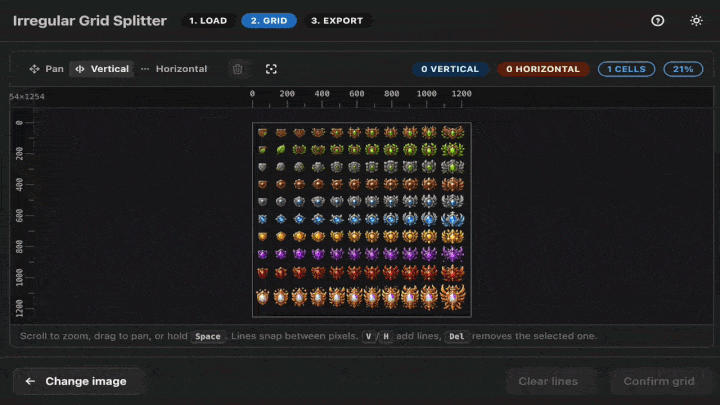

<div align="center">

# Irregular Grid Splitter

**Draw a grid, any grid — then split your image along it.**

Sprite sheets, scanned contact sheets, comic pages, tileset atlases: drop an
image, sketch out vertical and horizontal cut lines wherever you need them
(not just even rows and columns), and export exactly the cells you want.

[](./LICENSE)
[](https://tauri.app)
[](https://github.com/CiaccoDavide/irregular-grid-splitter/releases/latest)



**[Try it in your browser →](https://ciaccodavi.de/projects/irregular-grid-splitter)**

</div>

## Features

- **Irregular grid, not just a uniform one** — place cut lines exactly where
  you need them, at any spacing.
- **Pixel-perfect placement** — smooth pan and zoom with a faint pixel grid,
  so lines always snap cleanly between pixels.
- **Any common raster format in** — PNG, JPEG, WebP, GIF, BMP, AVIF.
- **Review before you export** — every cell is generated as a preview you can
  keep or exclude, with click / Shift-click / Ctrl-click multi-select and
  bulk actions.
- **Download how you like** — grab a single cell or zip up everything you
  kept.
- **Optional guided tour** — a short interactive walkthrough for first-time
  use, replayable any time from the header.
- **Private by default** — everything runs locally; your image never leaves
  your machine.
- **Web or desktop** — use it straight from the browser, or install a native
  app for macOS, Linux, and Windows.

## Download the desktop app

Native builds for macOS, Linux, and Windows are published on the
[**Releases**](https://github.com/CiaccoDavide/irregular-grid-splitter/releases/latest)
page.

| Platform | File |
| --- | --- |
| macOS | `.dmg` |
| Windows | `.msi` or `.exe` (NSIS) |
| Linux | `.AppImage` or `.deb` |

These builds are unsigned, so your OS may warn you the first time you open
them:

- **macOS**: right-click the app → *Open* (only needed once).
- **Windows**: click *More info* → *Run anyway* on the SmartScreen prompt.
- **Linux (AppImage)**: `chmod +x Irregular*.AppImage` before running it.

## Run from source

Requires [Node.js](https://nodejs.org) and [pnpm](https://pnpm.io).

```bash
pnpm install
pnpm dev        # start the web app
pnpm build      # static build in dist/, deployable anywhere
```

### Desktop build

Building the native app additionally requires the
[Rust toolchain](https://www.rust-lang.org/tools/install) and Tauri's
[platform prerequisites](https://v2.tauri.app/start/prerequisites/).

```bash
pnpm desktop:dev    # run the desktop app in dev mode
pnpm desktop:build  # produce an installer for your current OS
```

## Tech stack

- [React](https://react.dev) + TypeScript, built with [Vite](https://vite.dev)
- [Mantine](https://mantine.dev) for UI components
- [Tauri](https://tauri.app) for the native macOS/Linux/Windows shell
- [driver.js](https://driverjs.com) for the optional interactive tour
- [JSZip](https://stuk.github.io/jszip/) for bulk downloads

## License

[MIT](./LICENSE) — do what you want with it.
